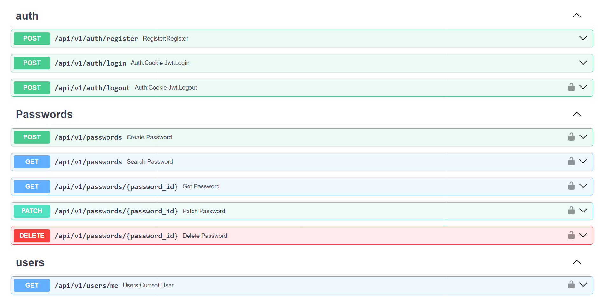

# Secrets API


Разворачиваемый менеджер паролей с AES шифрованием.

---
**Backend:** https://github.com/everysoftware/secrets
**Frontend:** https://github.com/everysoftware/secrets-frontend
---

## Фичи

* **Безопасная авторизация** с использованием JWT-токенов.
* **Шифрование паролей**. Применяется алгоритм симметричного шифрования AES. Данные
  шифруются с помощью заданного секретного ключа.

## Стек технологий

Python 3.12 • FastAPI • SQLAlchemy • cryptography

## Сборка

1. Клонируйте репозиторий:

    ```bash
    git clone https://github.com/everysoftware/secrets
    ```
2. Создайте `.env` файл - используйте `.env.example` как референс.

3. Запустите приложение:

    ```bash
       make up
    ```

## Скриншоты



**Made with ❤️ by Ivan Stasevich**
